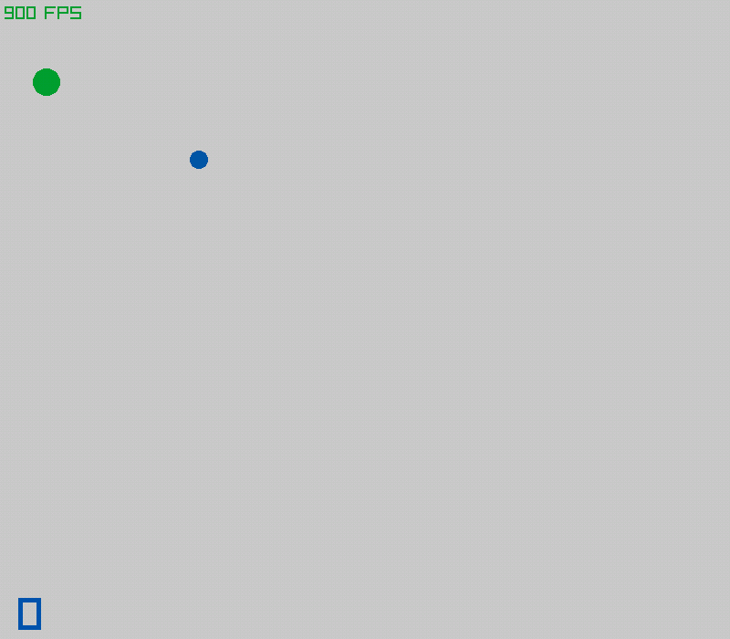

# SNASKET
Titulo inspirado en "Caskets" del NehruvianDOOM

<video src="demos_gif/2023-11-02 14-17-00.mp4" controls title="demostracion video"></video>

##### raylib
<https://github.com/raysan5/raylib>
##### libpd
<https://github.com/libpd/libpd>
##### portaudio
<https://github.com/PortAudio/portaudio>
##### msf_gif
<https://github.com/notnullnotvoid/msf_gif>

###### Todas las dependencias se encuentran en este mismo repositorio
###### El compilador utilizado de gcc es del [w64devkit](https://github.com/skeeto/w64devkit).
###### Al igual que el GNU Make es parte de ese kit.

El proyecto es una prueba de porfin hacer un jueguito en raylib e integrar Pure Data mediante la libreria de libpd. 

Si no peudes compilar aunque estes usando w64devkit entonces debes
realizar lo siguiente:
1. Descargar el codigo fuente de libpd y seguir sus instrucciones de compilacion
2. Colocar los archivos resultado de la compilacion en sus respectivas carpetas en este proyecto
3. Descargar el codigo fuente de portaudio y compilarlo
4. Colocar los archivos resultado de la compilacion en sus respectivas carpetas en este proyecto   
